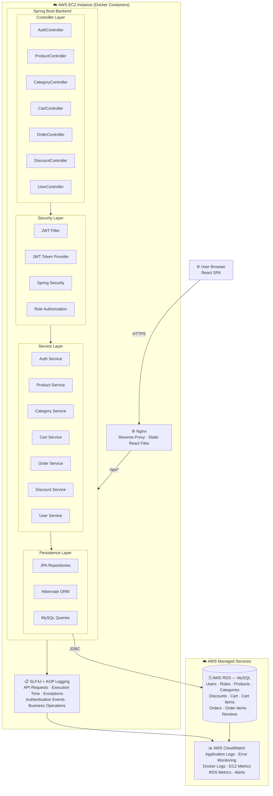

# 🛒 ShopCart — System Architecture

## Architecture Overview



---

## Layer Breakdown

| Layer | Components | Responsibility |
|---|---|---|
| **Frontend** | React SPA | UI, routing, state management |
| **Reverse Proxy** | Nginx | SSL termination, static file serving, API routing |
| **Controller** | 7 REST controllers | HTTP request handling, input validation |
| **Security** | JWT + Spring Security | Authentication, role-based authorization |
| **Service** | 7 business services | Core business logic, transaction management |
| **Persistence** | JPA / Hibernate | ORM, database queries |
| **Database** | AWS RDS MySQL | Persistent data storage (10 tables) |
| **Logging** | SLF4J + AOP | Cross-cutting observability, audit trail |
| **Monitoring** | AWS CloudWatch | Metrics, logs, alerting |

---

## Security — Role Hierarchy

```
SUPER_ADMIN  ──▶  full platform access
    ADMIN    ──▶  product, category, discount, order management
     USER    ──▶  browse, cart, checkout, reviews
```

---

## Database Schema (Tables)

```
Users · Roles · Products · Categories · Discounts
Cart · Cart Items · Orders · Order Items · Reviews
```

---

## Tech Stack

| Layer | Technology |
|---|---|
| Frontend | React.js |
| Backend | Spring Boot (Java) |
| Authentication | JWT (JSON Web Tokens) |
| ORM | Hibernate / JPA |
| Database | MySQL on AWS RDS |
| Web Server | Nginx |
| Containerization | Docker |
| Hosting | AWS EC2 |
| Logging | SLF4J + Spring AOP |
| Monitoring | AWS CloudWatch |
